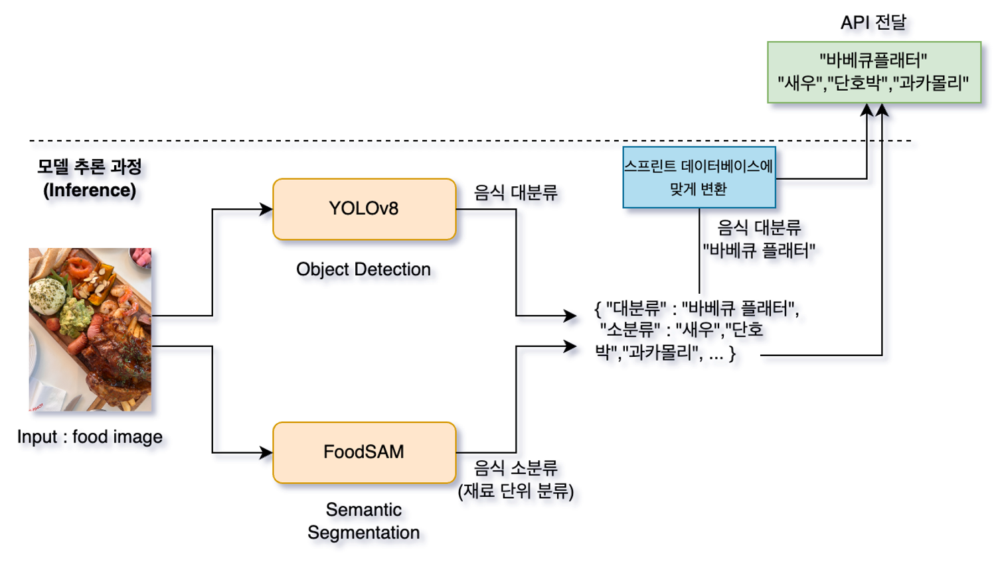
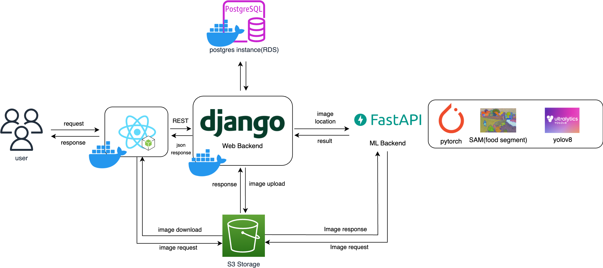
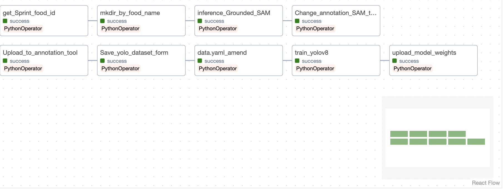
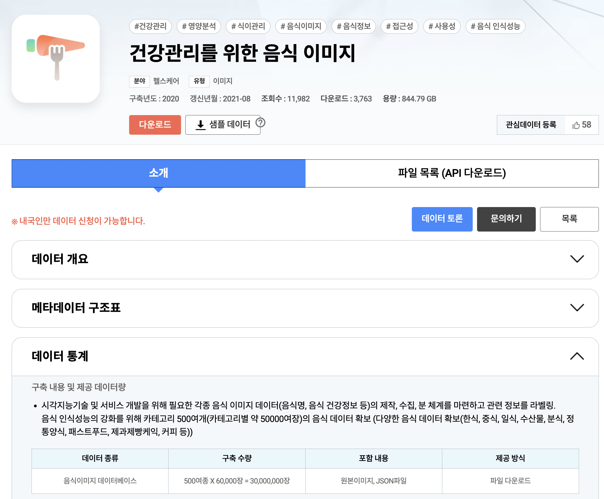

# FOOD Detection Project

---

## Introduction

---

**음식의 사진을 이용하여 음식을 분류하는 프로젝트입니다.**

음식의 종류를 구분하는 Object Detection 모델(Yolov8)과 원재료 탐지하는 Semantic Segementation 모델(FoodSAM)을 사용했습니다.  
        
식품영양정보 데이터베이스를 통해 음식의 영양정보 및 칼로리를 조회할 수 있도록 구성하였으며 캘린더 형식으로 음식 기록/조회/업데이트/삭제 가능 하도록 웹 데모를 제작하였습니다. (Thin9-Back, Thin9-Front 레파지토리 참고)  
        

데이터를 수집/전처리/학습 시키기위한 파이프라인은 airflow로 구성하였으며, S3 저장소에 이미지를 불러와 self-annotation을 진행합니다 (auto-distill, GroundedSAM 모델활용) 이후 yolo 데이터셋에 맞게 수정한 뒤 makesense로 annotation을 수정하는 작업을 거칩니다. 이후 처리가 완료된 디렉토리 구조에 맞추어 다음 workflow를 실행합니다. 해당 workflow는 학습을 위한 workflow 입니다. (YOLO-PIPELINE)  
       

## Data Set

[AI 허브](http://aihub.or.kr/)

**건강관리를 위한 음식 이미지 데이터셋을 활용하였습니다.**
       

## Data preprocessing

---

- 바운딩 박스를 표현하는 방법에는 여려 가지가 있습니다. Object Detection 모델로 YOLO를 사용하기 때문에 중심좌표_x, 중심좌표_y, width, height를 상대적으로 표현해 기록할 수 있도록 기존 데이터를 바꾸어줍니다.
- 학습을 위해 디렉토 구조를 train/test/validation로 분리하고 이미지와 어노테이션을 정의한 파일을 images와 labels(정답) 하위로 옮겨줍니다. 이 때, 확장자만 다르고 annotation은 같아야합니다.

## Training
- 학습을 위한 방법은 YOLO-PIPELINE 디렉토리를 통해 확인하시기 바랍니다.

## File Tree
root 
┣ Thin9 
┃ ┣ README.md(this) 
┃ ┣ yolov8-fastapi 
┃ ┃ ┣ README.md 
┃ ┃ ┣ FoodSAM 
┃ ┃ ┃ ┣ README.md 
┣ Thin9-Back 
┃ ┣ docker-compose.yml 
┃ ┣ README.md 
┣ Thin9-Front 
┃ ┣ docker-compose.yml 
┃ ┣ README.md 
 

#### 레파지토리 주소
- front : https://github.com/MJU-AIDA/Thin9-Front
- back : https://github.com/MJU-AIDA/Thin9-Front
- models (2개의 디렉토리로 구성) : https://github.com/MJU-AIDA/Thin9

#### To understand how backend server and model api interact
#### check below file

[* views.py]
- ImageUpload() 
root 
┣ Thin9-Back 
┃ ┣ main
┃ ┃ ┣ views.py

## Installation
 - 설치 및 실행방법은 각 디렉토리 하위 README.md 참고해주시기 바랍니다.
