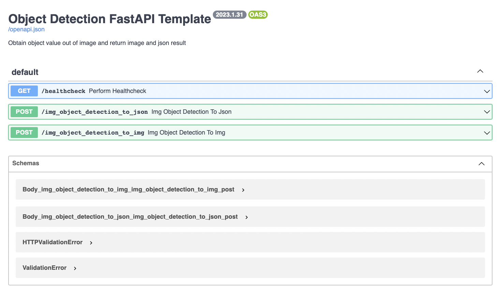

# YOLOv8-FastAPI:
This repository serves as a template for object detection using YOLOv8 and FastAPI. With YOLOv8, you get a popular real-time object detection model and with FastAPI, you get a modern, fast (high-performance) web framework for building APIs. The project also includes Docker, a platform for easily building, shipping, and running distributed applications.

### Sample
Here's a sample of what you can expect to see with this project:


# What's inside:

- YOLOv8: A popular real-time object detection model
- FastAPI: A modern, fast (high-performance) web framework for building APIs
- Docker: A platform for easily building, shipping, and running distributed applications

</a>

---
# Getting Started

You have two options to start the application: using Docker or locally on your machine.

## Using Docker
Start the application with the following command:
```
docker-compose up
```

## Locally
To start the application locally, follow these steps:

1. Install the required packages:

```
pip install -r requirements.txt
```
2. Start the application:
```
uvicorn main:app --reload --host 0.0.0.0 --port 8001
```  
*Note: You can change the address and port in the file **docker-compose.yaml***

## FAST API Docs url:
http://0.0.0.0:8001/docs#/

    

# Overview of the code
* [main.py](./main.py) - Base FastAPI functions  
* [app.py](./app.py) - YoloV8 functions     
* [./models](./models) - YoloV8 models folder    